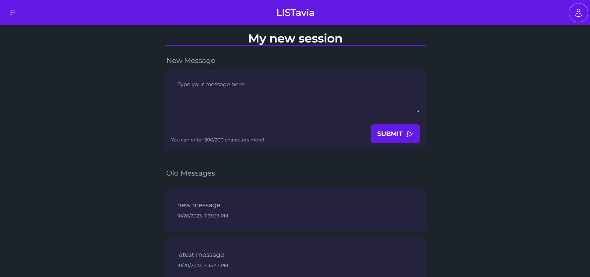
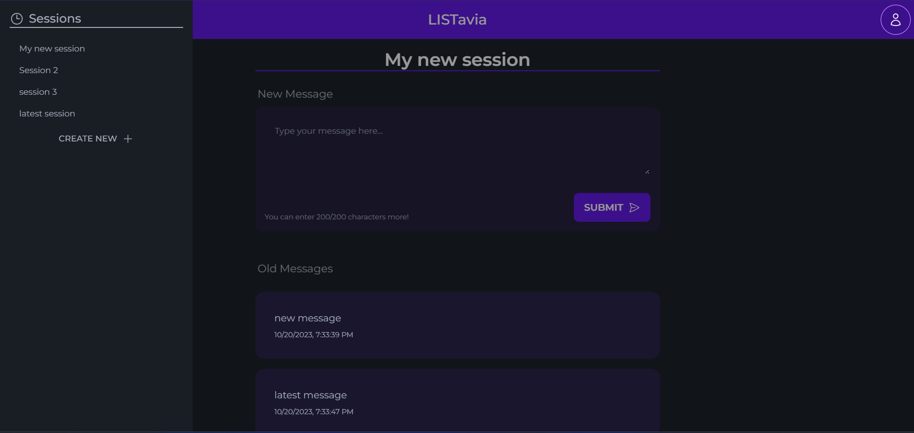
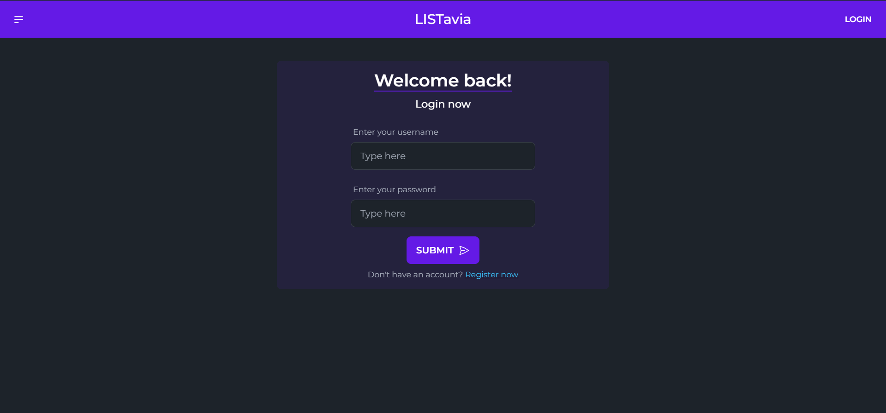
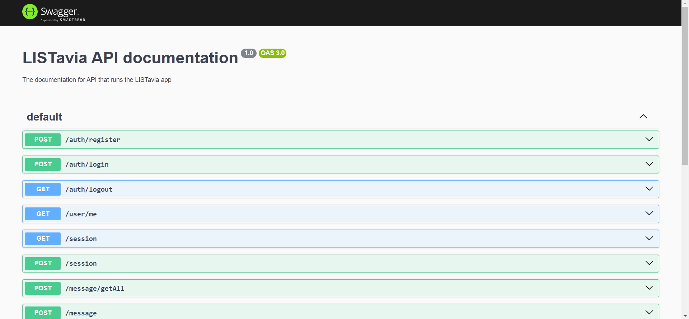

# LISTavia

A simple app that lets you make different sessions and have messages in each session separate from each other with full authentication and multi-user support!

## Usage

**NOTE:** This is a monorepo which contains both the backend and the frontend along with some configuration packages and a UI library.

1. Begin by cloning this repo to your computer: `git clone https://github.com/sethigeet/listavia`
1. Next, change directory to this cloned repo: `cd listavia`
1. Now install the required dependencies using your preferred package manager (though I use `pnpm`): `pnpm install`
1. Now go ahead and build all the required apps in the repo: `pnpm -w build`
1. Add the required environment variables either through your running shell or by creating a `.env` file in the `apps/api` directory. (To see the required variables, see `.env.example` in `apps/api`)
1. To run the backend, go into the `api` app and run the built app: `cd apps/api; pnpm start:prod`
1. To run the frontend, go into the `web` app and run the built app: `cd app/web; pnpm start`

Now go ahead and view the running app at [localhost:3000](http://localhost:3000) and see the API docs at [localhost:4000/docs](http://localhost:4000/docs)

**NOTE:** This project currently uses `sqlite` as the database though this can be easily changed by changing the driver that is being used by prisma in `apps/api/prisma/schema.prisma`. For development or testing purposes, you can use `sqlite`. For this, set the `DATABASE_URL` environment variable to `"file:./dev.db"`

**NOTE:** You might see some errors regarding config files for `eslint` during the build process but these errors actually do not exist but show up when you build each app separately during the build process of the workspace and this is a monorepo and all config files are shared!

## Technologies Used

- Typescript
- Node.js
- Nest.js
- React.js
- Next.js
- TailwindCSS
- TurboRepo
- Prisma
- Eslint
- Prettier
- ... and many more

## Preview

